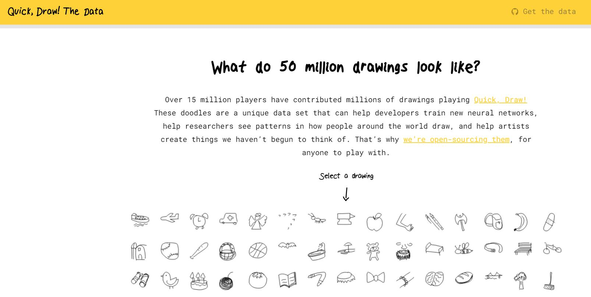
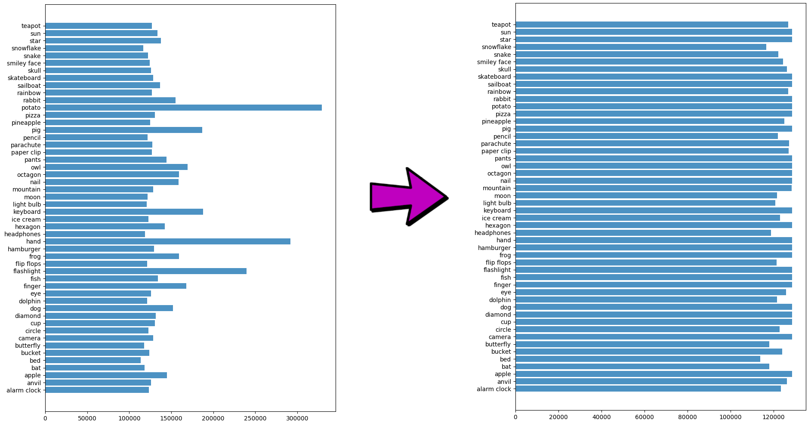
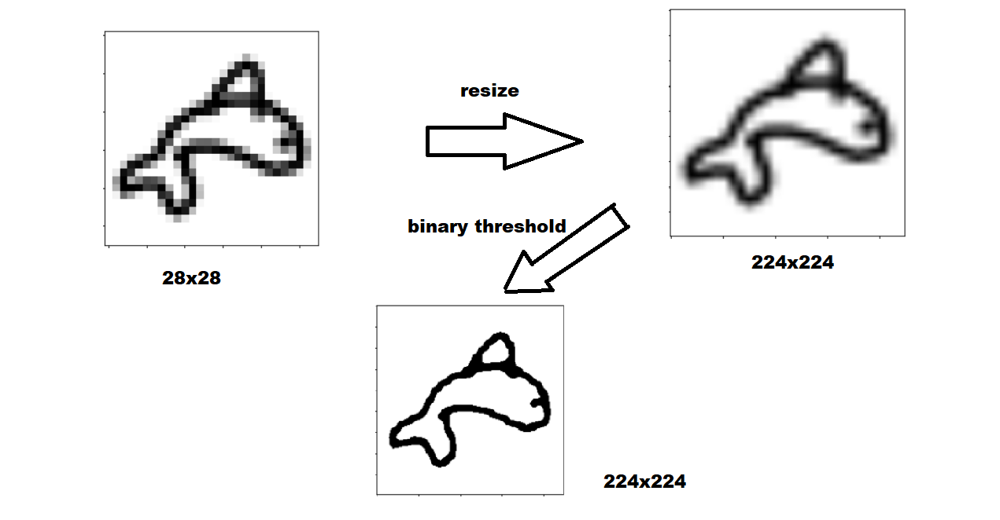
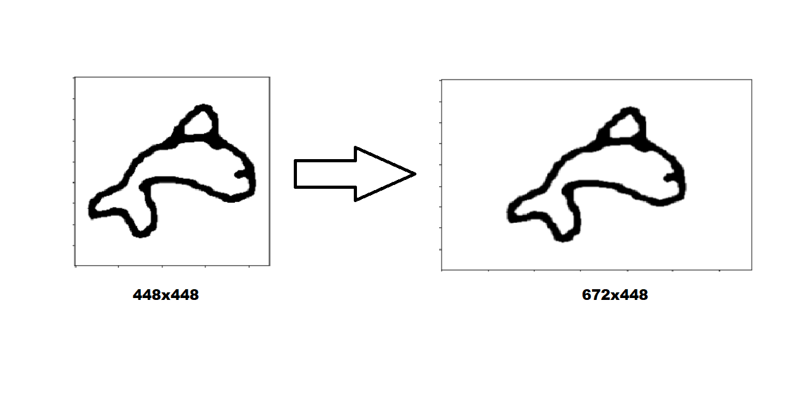
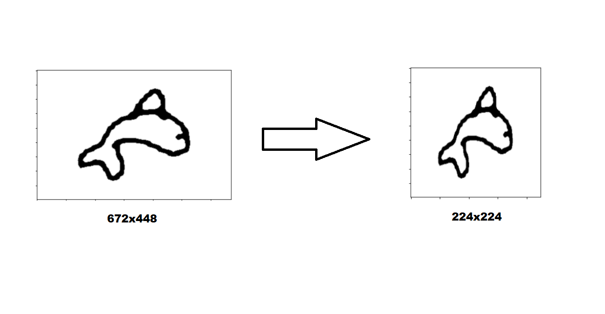
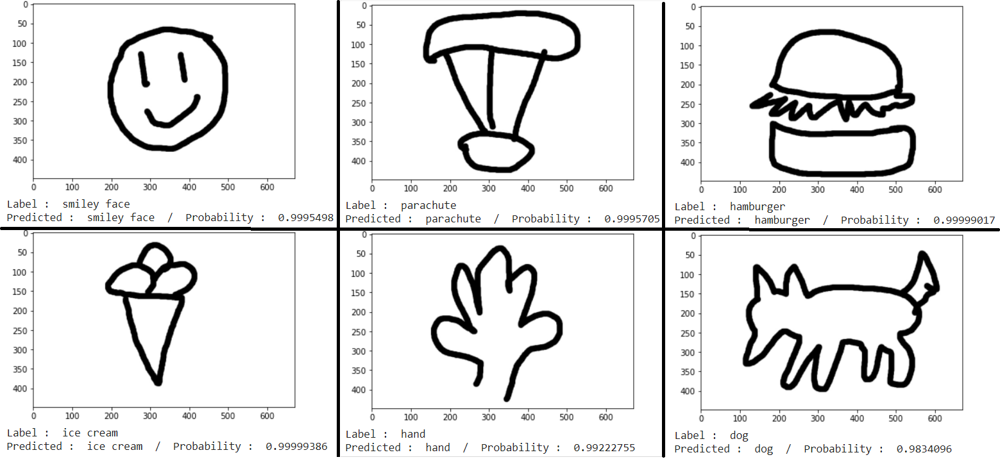

# Guess What You Draw ( Doodles Image Classifier )

## Introduction

This project is part of [Guess-What-You-Draw Web Game](https://github.com/WatcharitNew/Guess-What-You-Draw) and aim to develop model for classifying [50 categories](https://github.com/ThreeTeaTree/Guess-What-You-Draw-Doodles-Classifier/blob/main/doodleDataset/50classList.txt) of doodle image that use to guess what player draw in the game.

## Dataset

### About Datasets

We use dataset from [Google's Quick Draw!](https://quickdraw.withgoogle.com/data) and we select 50 categories from them.

Data is not included in this repository. You need to download npz files corresponding to 50 classes and data download part also included in notebook (You can [read more](https://github.com/googlecreativelab/quickdraw-dataset#get-the-data) how we get the data).

It data made available by Google, Inc. under the Creative Commons Attribution 4.0 International license. <https://creativecommons.org/licenses/by/4.0/>

### Numpy bitmaps (`.npy`)

All the simplified drawings have been rendered into a 28x28 grayscale bitmap in numpy `.npy` format. The files can be loaded with [`np.load()`](https://docs.scipy.org/doc/numpy-1.12.0/reference/generated/numpy.load.html). These images were generated from the simplified data, but are aligned to the center of the drawing's bounding box rather than the top-left corner. [See here for code snippet used for generation](https://github.com/googlecreativelab/quickdraw-dataset/issues/19#issuecomment-402247262).

### Data Exploration

We found some class have too much sample so that we will prune some data in majority class to prevent overfitting in our model.

## Data Preparation & preprocessing

We need to preprocess our data to fitting our web canvas environment and resize it to 224x224 for training in MobileNetV2 with ImageNet pretrain.

### Preprocessing method

1. resize image from 28x28 to 224x224 and use binary threshold to sharpen the image.

2. resize to 448x448 and place it on middle of blank image size 672x488 ( web canvas size is 672x488 so that we need to preprocess like this ).

3. resize image from 672x488 to 224x224 and Normalized for ImageNet pretrain weight.

## Image Recognition Model

We use MobileNetV2, convolutional neural network that is 53 layers deep ( paper : [MobileNetV2: Inverted Residuals and Linear Bottlenecks](https://arxiv.org/abs/1801.04381) ) because MobileNetV2 is designed to be light-weight. It is much smaller and faster with acceptable accuracy. and use ImageNet pretrain weight.

## Experiment and Result

### Train/Test split and Training hyperparameter

We split train set and test set with ratio 85:15 and training setting below.

1. number of epochs: 5
2. Adam optimizer with learning rate = 0.0001

### Result

Accuracy on test set is **92.61%**

### Test with handcraft test set

We draw some image to test the model. Let see the result.

